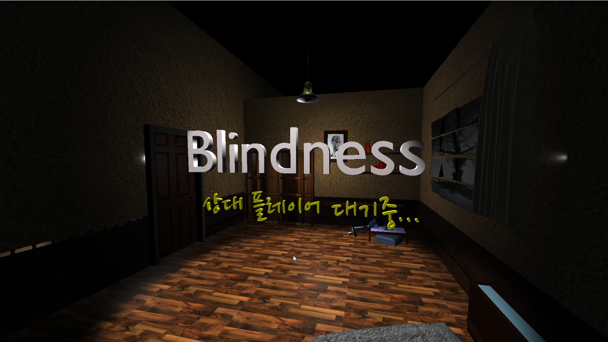
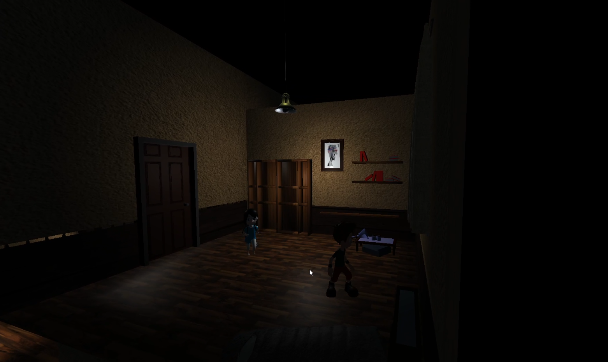
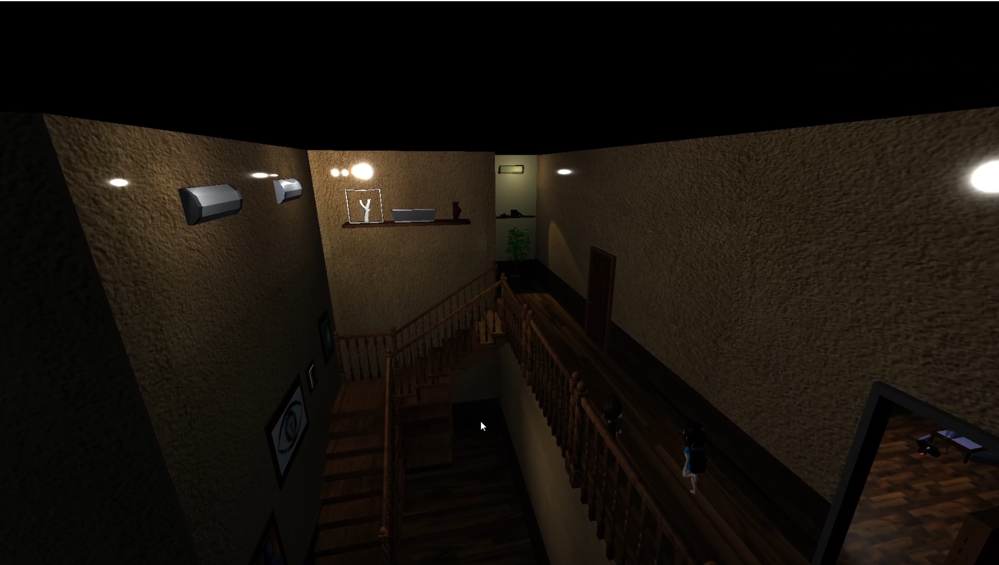
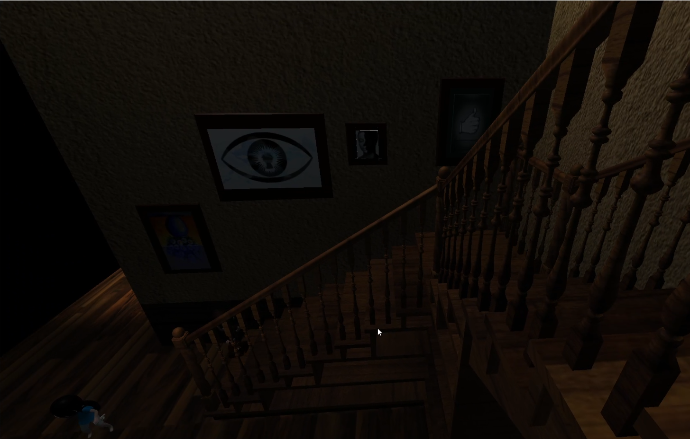
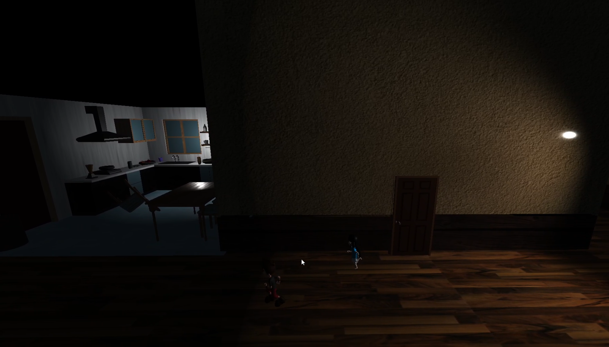
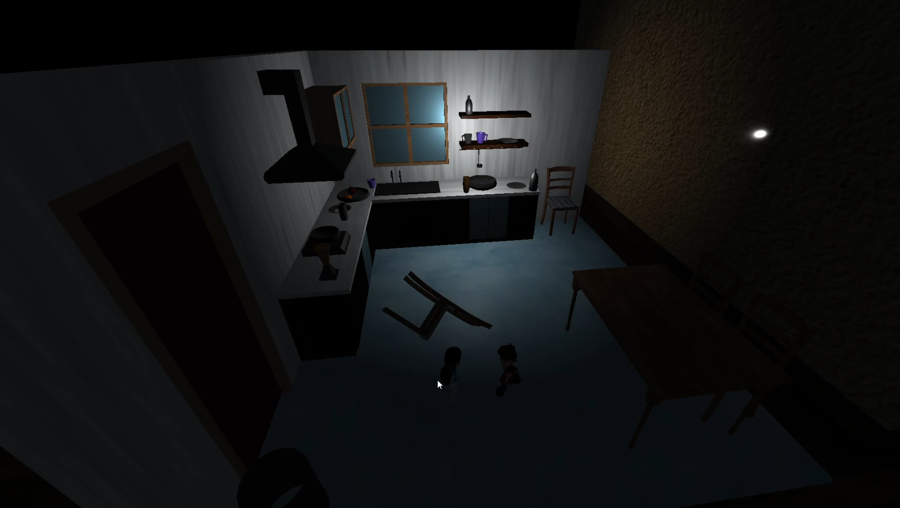

SmartPhone Control 
WebGame Project
==================
###### 스마트폰으로 컨트롤하는 웹 게임 프로젝트

Blindness
=========

<u>Dep. ITSoftware Enginnering. </u>
Team. 포켓몬고는 다음에 개발할게요. 
######
<b>졸업작품 프로젝트<b>

--- 
## Developers.
### Web 개발 Team.
* <em>Project Manager.</em> <b>김윤권</b>
    ####
    - GoormIde, Node.js, Express.js, Socket.io 통한 개발 환경 구성
    #####
    - Server 단 Socket.io Room 개념 이용 2인 멀티플레이 구현
        +  Random 초대 코드 통한 개인 Room 생성 
        +  초대 코드의 Room Name 적용 통한 상대 플레이어와 연결
        +  Browser 와 Server 간 웹 소켓 연결 
        +  플레이어 서로의 위치 및 클리어 조건 동기화  
    #####
    - Client 단 Three.js 응용 캐릭터와 맵 충돌 구현
        + Blender 통한 투명 충돌 Mesh Scene 내 Visible = false 적용
        + raycast 적용 통한 충돌 Mesh 와 캐릭터 Hitbox 간 거리 판단하여 충돌 구현
    #####

    - zxing QR코드 라이브러리 응용 브라우저와 Android Application 연동 https://github.com/zxing/zxing

##
* <em>3D Graphic Designer.</em> <b>지한영</b>
    ####
    - Blender 응용 게임 맵 디자인
        + 전체 맵 기획 시작방, 악당방, 부엌 디자인
        + Three.js PointLight 응용 맵 내 조명 조절 통한 게임 분위기 조성
               
    #####
    - Three.js Camera 응용 통한 각 플레이어 시점 조정
        + Interaction Mesh 응용통한 맵 위치 별 쉬운 플레이어 식별 위한 카메라 조정
    #####

##
### Mobile Application 개발 Team.
* <em>Android Application Developer. </em> <b>이시헌</b>
    ####
    - Android 조이스틱 컨트롤러 디자인
    - Android Studio 응용 Application Activity UI 디자인
    - Android 단 Socket.io 적용 데이터 통신 구현

##
* <em>IOS Application Developer. </em> <b>조현수</b>
    ####
    - IOS 조이스틱 컨트롤러 디자인
    - Swift 응용 IOS Application 구현
    - Socket.io Swift 적용 데이터 통신 구현

--- 
## ScreenShots

---
## 사용한 오픈소스 3D 모델링
#### Thanks To!

여자 캐릭터 : https://blendswap.com/blend/22735
남자 캐릭터 : https://blendswap.com/blend/15500
주방 식탁 : https://blendswap.com/blend/22549

---
## 추가로 개발에 도움 주신 분들 : 
#### Thanks To !
아이디어 지원 : 김태우 - https://github.com/Taewoo-Git
Javascript 응용 지원 : 홍성준 - https://github.com/platina78